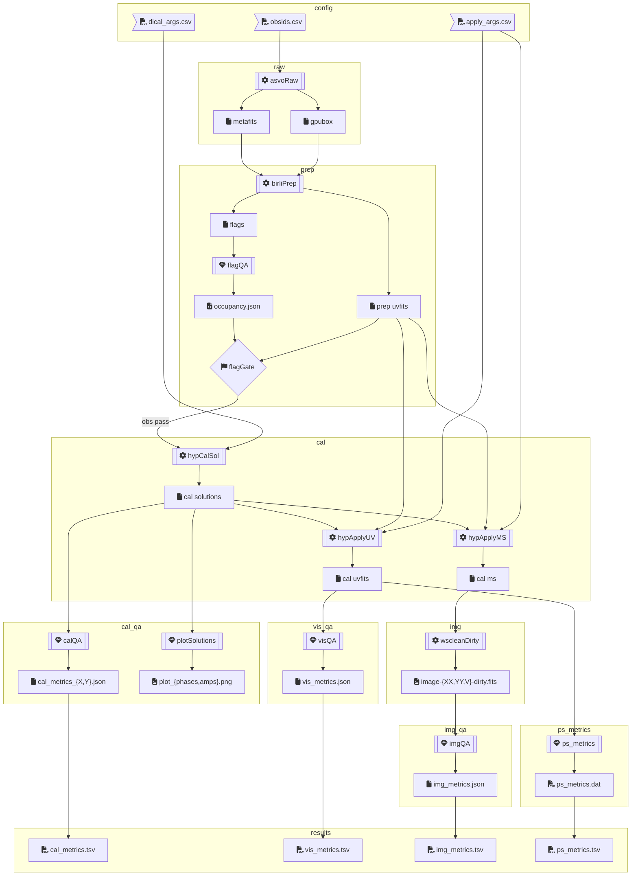

# MWA EoR Nextflow Pipeline

## Flow



## Components

main tasks:

- obsid → **`asvoRaw`** → obsid, metafits, \*gpufits
  - if obsid raw not stored, schedule ASVO download job to Accacia with
    [Giant Squid](github.com/mwaTelescope/giant-squid), wait,
    download with `wget`, untar with `tar`
  - ASVO wait times can be between a few minutes and a few days, so job will
    wait with ASVO socket open for an hour, then exponential backoff for $2^a$
    hours for attempt number $a$, up to 5 attempts
  - store: `${obsid}/raw`
  - resources: mem
- metafits, \*gpufits → **`birliPrep`** → prepUVFits, \*mwaf, birliLog
  - if prepUVFits for obsid not stored, preprocess and flag with `birli`
  - store: `${obsid}/prep`
  - resources: mem, cpu
- metafits, mwaf → **`flagQA`** → occupancy
  - get total flag occupancy, and occupancy for each coarse channel
  - reject obs flag occupancy is above threshold
- metafits, prepUVFits, dicalArgs → **`hypCalSol`** → \*calSol, \*dicalLog
  - if calSols not stored, `hyperdrive di-calibrate` with dicalArgs
  - store: `${obsid}/cal${params.cal_suffix}`
  - resources: mem, gpu
- metafits, prepUVFits, calSol, visName, applyArg → **`hypApplyUV`** → calUVFits, applyLog
  - if calUVFits for (obsid × visName) not stored, `hyperdrive solutions-apply` with applyArg
  - store: `${obsid}/cal${params.cal_suffix}`
  - resources: mem, cpu
- name, metafits, calUVFits → **`wscleanDirty`** → img{XX,YY,V}Dirty
  - dirty images of stokes XX,YY,V via [wsclean](https://gitlab.com/aroffringa/wsclean)

qa tasks:

- obsid, metafits → **`metaStats`** → obsid, metafitsJson
  - get flagged inputs from metafits
  - size of raw vis for missing hdu fraction
- obsid, prepUVfits, birliLog → **`prepStats`** → obsid, prepStatsJson
  - from prep uvfits: count timesteps, channels, baselines
  - from birli log: collect
  - store: `${obsid}/prep`
- obsid, name, metafits, calSol → **`calQA`** (#3) → obsid, calMetricsXJson, calMetricsYJson
  - [mwa_qa](https://github.com/Chuneeta/mwa_qa) `scripts/run_valqa.py`
  - needs a unique name for each calibration
- obsid, name, metafits, calSol → **`plotSolutions`** → obsid, phasesPng, ampsPng
  - plot calibration solution gains,phases with `hyperdrive solutions-plot`
- obsid, name, calUVFits → **`visQA`** → obsid, visMetrics
  - [mwa_qa](https://github.com/Chuneeta/mwa_qa) `scripts/run_visqa.py`
  - needs a unique name for each vis
- obsid, name, calUVFits → **`psMetrics`** (#1/#2) → obsid, psMetricsDat
  - window/wedge/total power/subtraced power iono proxy via [chips](https://github.com/cathryntrott/chips) `src/ps_power_metrics.c`
- obsid, name, imgXXDirty, imgYYDirty, imgVDirty → **`imgQA`** (#4) → imgMetricsJson
  - [mwa_qa](https://github.com/Chuneeta/mwa_qa) `scripts/run_valqa.py`
  - flux density ratio of stokes, ratio of corner thermal noise RMS, variance, ratio stokes V/XX V/YY
  - needs a unique name for each image

## Output Directory Structure:

- `${params.outdir}/` (e.g. `/data/curtin_mwaeor/data/`)
  - `${obsid}/`
    - `raw/` - raw gpubox fits, metafits, metafits json
    - `prep/` - preprocessed birli vis uvfits (weights encode flags), flag mwaf, birli log,
      preprocessing stats json
    - `cal${params.cal_suffix}/` - calibrated vis uvfits, di-cal solution fits, hyperdrive di-cal,
      apply log
    - `img/` - wscleaned dirty XX,YY,V image fits
    - `flag_qa/` - flag occupancy json
    - `cal_qa/` - calibration metrics json, hyperdrive solution amp,phase plot png
    - `vis_qa/` - visibility metrics json
    - `img_qa/` - image metrics json
    - `ps_metrics/` - power spectrum metrics dat, log
- `${projectDir}/` (e.g. `/data/curtin_mwaeor/src/MWAEoR-Pipeline/`)
  - `results/` - output files for spreadsheet
    - `metafits_stats.tsv` - info from metafits
    - `prep_stats.tsv` -

## Configuration

populate `obsids.csv`:

```
obsid1
obsid2
```

populate `dical_args.csv` as `dical_name,dical_args`, e.g. :

```
30l_src4k,--uvw-min 30l -n 4000
50l_src4k,--uvw-min 50l -n 4000
```

populate `apply_args.csv` as `dical_name,apply_name,apply_args`:

```
30l_src4k,8s_80kHz,--time-average 8s --freq-average 80kHz
50l_src4k,8s_80kHz,--time-average 8s --freq-average 80kHz
30l_src4k,4s_80kHz,--time-average 4s --freq-average 80kHz
```

all other config is in `nextflow.config`. See: <https://www.nextflow.io/docs/latest/config.html>

parameters can also be specified in the newflow command line for each run too. e.g. set `params.obsids_path` with `--obsids_path=...`

## usage

load modules - conflicts with singularity for dumb Java reasons.

```
module unload singularity
module load nextflow
```

run everything (use `obsids.csv` by default)

```
nextflow run main.nf -profile dug -with-timeline -with-report -with-dag --asvo_api_key=$MWA_ASVO_API_KEY
```

run only a subset of obsids:

```
nextflow run main.nf -profile dug -with-timeline -with-report -with-dag --asvo_api_key=$MWA_ASVO_API_KEY \
  --obsids_path=obsids-1090X.csv
```

## Handy DuG commands

### get an interactive session with gpus

```bash
salloc --partition=curtin_mwaeor --constraint=v100 --time=1:00:00
srun --pty bash
```

### run hyperdrive di-cal

needs GPU, see above

```bash
module load cuda/11.3.1
module load gcc-rt/9.2.0
export HYPERDRIVE_CUDA_COMPUTE=... # 80 for a100s, 70 for v100s
export MWA_BEAM_FILE="/data/curtin_mwaeor/data/mwa_full_embedded_element_pattern.h5"
export CUDA_VISIBLE_DEVICES=... # optional, restrict CUDA devices.
export obsid=...
export cal_name=... # optional, e.g. "30l_src4k", "50l_src4k"
export apply_args=... # optional, e.g. "--uvw-min 30l -n 4000", "-v"
export sourcelist="/data/curtin_mwaeor/data/srclist_pumav3_EoR0LoBESv2_fixedEoR1pietro+ForA_phase1+2.yaml"
cd /data/curtin_mwaeor/data/${obsid}/
/usr/bin/time /data/curtin_mwaeor/sw/bin/hyperdrive di-calibrate ${cal_args} \
  --data "raw/${obsid}.metafits" "prep/birli_${obsid}.uvfits" \
  --beam "${MWA_BEAM_FILE}" \
  --source-list "${sourcelist}" \
  --outputs "hyp_soln_${obsid}_${cal_name}.fits" \
  | tee hyp_di-cal_${obsid}_${cal_name}_test.log
```

### run hyperdrive apply solutions

```bash
module load gcc-rt/9.2.0
export obsid=...
export cal_name=... # either "30l_src4k" or "50l_src4k"
export apply_args=... # optional, e.g. "--time-average 16s --freq-average 160kHz", "-v"
cd /data/curtin_mwaeor/data/${obsid}/
/usr/bin/time /data/curtin_mwaeor/sw/bin/hyperdrive solutions-apply ${apply_args} \
  --data "raw/${obsid}.metafits" "prep/birli_${obsid}.uvfits" \
  --solutions "cal/hyp_soln_${obsid}_${cal_name}.fits" \
  --outputs "hyp_${obsid}_${cal_name}_test.uvfits" | tee "hyp_${obsid}_${cal_name}_test.log"
```

### get times of jobs for a run

```bash
export run="elegant_euclid"
nextflow log $run -F 'process=="calQA"' -f workdir,exit,status,process,duration
```

### get all lines matching pattern from all scripts executed recently

```bash
export process="metaStats"
export first_run="$(nextflow log -q | head -n 1)"
export first_run="scruffy_bhaskara"
echo -n $'${start} ${workdir} ${script.split(\'\\n\').findAll {it =~ /.*out.*/}[0]}' | tee template.md
nextflow log -after $first_run -F 'process=="'${process}'"&&exit==0' -t template.md
```

### Updating singularity images

e.g. Birli or mwa_qa

```bash
module load singularity
# export container="birli"
export container="mwa_qa"
# export url="docker://mwatelescope/${container}:latest"
export url="docker://d3vnull0/${container}:latest"
cd /data/curtin_mwaeor/sw/singularity/
if [ ! -d $container ]; then mkdir $container; fi
singularity pull --force --dir $container "$url"
```

optional: update `profiles.dug.params.birli` in `nextflow.config`

### Cancel all failed jobs

```bash
squeue --states SE --format %A -h | sort | xargs scancel
```

### get disk usage

```bash
export stage="raw" # or prep, cal
find /data/curtin_mwaeor/data -type d -name "${stage}" | xargs du --summarize -h | tee "du_${stage}.tsv"
```

### dump gpufits

for legacy: `corr_type="MWA_ORD"`
for mwax: `corr_type="MWAX"`

```bash
module load python/3.9.7
export obsid=...;
export corr_type=...;
cd /data/curtin_mwaeor/data/${obsid}/raw/;
for gpufits in $(ls *.fits); do \
  python /data/curtin_mwaeor/src/Birli/tests/data/dump_gpufits.py \
    ${gpufits} \
    --corr-type $corr_type --timestep-limit 7 \
    | tee ${gpufits}.txt
done
```
