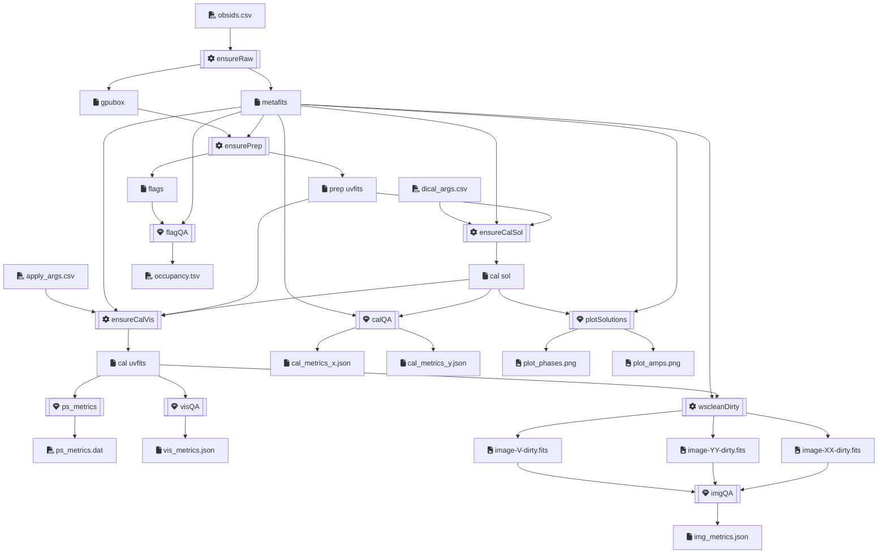

# MWA EoR Nextflow Pipeline

## Flow



## Components

- obsid → **`ensureRaw`** → obsid, metafits, \*gpufits
  - if obsid raw not stored, schedule ASVO download job with `giant-squid`, wait,
    download with `wget`, untar with `tar`
  - ASVO wait times can be between a few minutes and a few days, so job will
    wait with ASVO socket open for an hour, then exponential backoff for $2^a$
    hours for attempt number $a$, up to 5 attempts
  - store: `${obsid}/raw`
  - resources: mem
- obsid, metafits, \*gpufits → **`ensurePrep`** → obsid, prepUVFits, \*mwaf, log
  - if prepUVFits for obsid not stored, preprocess and flag with `birli`
  - store: `${obsid}/prep`
  - resources: mem, cpu
- obsid, metafits, prepUVFits, dicalArgs → **`ensureCalSol`** → obsid, \*calSol, \*log
  - if calSols not stored, `hyperdrive di-calibrate` with dicalArgs
  - store: `${obsid}/cal${params.cal_suffix}`
  - resources: mem, gpu
- obsid, metafits, prepUVFits, calSol, visName, applyArg → **`ensureCalVis`** → obsid, calUVFits, log
  - if calUVFits for (obsid × visName) not stored, `hyperdrive solutions-apply` with applyArg
  - store: `${obsid}/cal${params.cal_suffix}`
  - resources: mem, cpu
- obsid, metafits, mwaf → **`flagQA`** → obsid, occupancy
- obsid, name, calUVFits → **`visQA`** → obsid, visMetrics
- obsid, name, metafits, calSol → **`calQA`** → obsid, calMetricsXJson, calMetricsYJson
- obsid, name, metafits, calSol → **`plotSolutions`** → obsid, phasesPng, ampsPng
- obsid, name, metafits, calUVFits → **`wscleanDirty`** → obsid, imgXXDirty, imgYYDirty, imgVDirty
- obsid, name, calUVFits → **`psMetrics`** → obsid, psMetricsDat
- obsid, name, imgXXDirty, imgYYDirty, imgVDirty → **`imgQA`** → imgMetricsJson
- obsid, uvfits → **`visShape`** → obsid, shapeTsv
  - dump the number of timesteps, channels and baselines from the uvfits
  - store: `${obsid}/prep`

## Output Directory Structure:

- `${params.outdir}/` (e.g. `/data/curtin_mwaeor/data/`)
  - `${obsid}/`
    - `raw/` - metafits, gpufits
    - `prep/` - preprocessed uvfits, mwaf, birli log
    - `cal${params.cal_suffix}/` - calibrated uvfits, solutions
    -

## Configuration

populate `obsids.csv`:

```
obsid1
obsid2
```

populate `dical_args.csv`:

```
dical_name,dical_args
```

populate `apply_args.csv`:

```
dical_name,apply_name,apply_args
```

all other config is in `nextflow.config`. See: <https://www.nextflow.io/docs/latest/config.html>

parameters can also be specified in the newflow command line too.

## usage

```
module load nextflow

```

### Handy commands

## Updating singularity images

e.g. Birli

```bash
module load singularity
export container="birli"
export url="docker://mwatelescope/${container}:latest"
cd /data/curtin_mwaeor/sw/singularity/
if [ ! -d $container ]; then mkdir $container; fi
singularity pull --force --dir $container "$url"
```

then update `profiles.dug.params.birli` in `nextflow.config`

## get disk usage

```bash
export stage="raw" # or prep, cal
find /data/curtin_mwaeor/data -type d -name "${stage}" | xargs du --summarize -h | tee "du_${stage}.tsv"
```

# dump img_qa

```bash
find /data/curtin_mwaeor/data -type f -path '*/img_qa/*MFS.json' \
  | gawk 'match()
```

# dump flags

```bash
module load python/3.9.7
export obsid=1059505936
for i in {01..12}; do \
  python /data/curtin_mwaeor/src/Birli/tests/data/dump_mwaf.py \
    /data/curtin_mwaeor/data/${obsid}/prep/${obsid}_${i}.mwaf --summary
done
```

# Cancel all failed jobs

```bash
squeue --states SE --format %A -h | sort | xargs scancel
```

# failures

1059505936 - all flagged
1060539904 - past end of file
1061321664 - past end of file
1060540024 - past end of file
1059506184 - past end of file
1059506792 - all flagged
1059506056 - all flagged
1059506424 - past end of file
1059506304 - past end of file
1061321792 - past end of file
1061321424 - past end of file
1061319840 - past end of file
1061321056 - past end of file
1065196488 - past end of file
1061322032 - past end of file
1065196976 - past end of file
1065196248 - past end of file
1065196856 - past end of file
1065196120 - past end of file
1061322400 - past end of file
1061321304 - past end of file

1061320936 - past end of file

1322827024 - FileNotFoundError: [Errno 2] No such file or directory: 'hyp_1322827024_30l_src4k_4s_80kHz.uvfits'
1060540152 - FileNotFoundError: [Errno 2] No such file or directory: 'hyp_1060540152_30l_src4k_8s_80kHz.uvfits'
1060540272 - FileNotFoundError: [Errno 2] No such file or directory: 'hyp_soln_1060540272_50l_src4k_8s_80kHz.fits'
1060540272 - FileNotFoundError: [Errno 2] No such file or directory: 'hyp_soln_1060540272_30l_src4k_4s_80kHz.fits'

cleanup:

```
for obsid in 1061320448 1061320200 1065196248 1059506672 1060540152 1061319352 1061320568 1065196000 1065196488 1061319472 1061320080 1061321424 1061319224 1059506544; do
  [ -d /data/curtin_mwaeor/data/$obsid ] && rm -rf /data/curtin_mwaeor/data/$obsid
done

for obsid in 1061321424 1065196000 1061319840 1059506792 1061319104 1061319960 1061320568 1059505936 1060540272 1059506672 1059506056 1061320448 1060540024 1059506544 1061319224 1061320328 1060539904 1061319472 1065196488 1061319712 1060540152 1061320200 1059506304 1059506424 1059506184 1065196248 1061319352 1061320080; do\
  [ -d /data/curtin_mwaeor/data/$obsid ] && rm -rf /data/curtin_mwaeor/data/$obsid
done
```

# don't delete:

1090008640
1094490328
