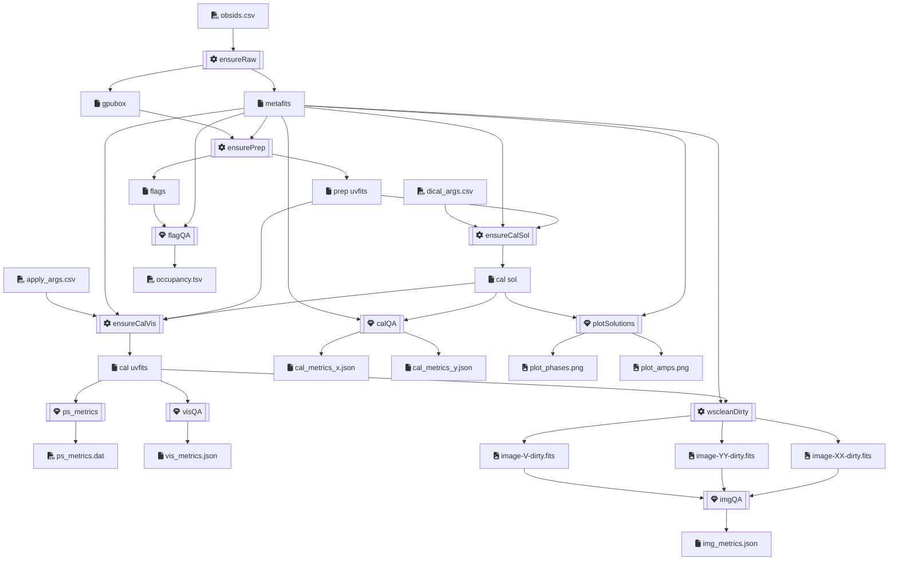

# MWA EoR Nextflow Pipeline

## Flow



## Components

- obsid → **`ensureRaw`** → obsid, metafits, \*gpufits
  - if obsid raw not stored, schedule ASVO download job with `giant-squid`, wait,
    download with `wget`, untar with `tar`
  - ASVO wait times can be between a few minutes and a few days, so job will
    wait with ASVO socket open for an hour, then exponential backoff for $2^a$
    hours for attempt number $a$, up to 5 attempts
  - store: `${obsid}/raw`
  - resources: mem
- obsid, metafits, \*gpufits → **`ensurePrep`** → obsid, prepUVFits, \*mwaf, log
  - if prepUVFits for obsid not stored, preprocess and flag with `birli`
  - store: `${obsid}/prep`
  - resources: mem, cpu
- obsid, metafits, prepUVFits, dicalArgs → **`ensureCalSol`** → obsid, \*calSol, \*log
  - if calSols not stored, `hyperdrive di-calibrate` with dicalArgs
  - store: `${obsid}/cal${params.cal_suffix}`
  - resources: mem, gpu
- obsid, metafits, prepUVFits, calSol, visName, applyArg → **`ensureCalVis`** → obsid, calUVFits, log
  - if calUVFits for (obsid × visName) not stored, `hyperdrive solutions-apply` with applyArg
  - store: `${obsid}/cal${params.cal_suffix}`
  - resources: mem, cpu
- obsid, metafits, mwaf → **`flagQA`** → obsid, occupancy
- obsid, name, calUVFits → **`visQA`** → obsid, visMetrics
- obsid, name, metafits, calSol → **`calQA`** → obsid, calMetricsXJson, calMetricsYJson
- obsid, name, metafits, calSol → **`plotSolutions`** → obsid, phasesPng, ampsPng
- obsid, name, metafits, calUVFits → **`wscleanDirty`** → obsid, imgXXDirty, imgYYDirty, imgVDirty
- obsid, name, calUVFits → **`psMetrics`** → obsid, psMetricsDat
- obsid, name, imgXXDirty, imgYYDirty, imgVDirty → **`imgQA`** → imgMetricsJson
- obsid, uvfits → **`visShape`** → obsid, shapeTsv
  - dump the number of timesteps, channels and baselines from the uvfits
  - store: `${obsid}/prep`

## Output Directory Structure:

- `${params.outdir}/` (e.g. `/data/curtin_mwaeor/data/`)
  - `${obsid}/`
    - `raw/` - metafits, gpufits
    - `prep/` - preprocessed uvfits, mwaf, birli log
    - `cal${params.cal_suffix}/` - calibrated uvfits, solutions
    -

## Configuration

populate `obsids.csv`:

```
obsid1
obsid2
```

populate `dical_args.csv`:

```
dical_name,dical_args
```

populate `apply_args.csv`:

```
dical_name,apply_name,apply_args
```

all other config is in `nextflow.config`. See: <https://www.nextflow.io/docs/latest/config.html>

parameters can also be specified in the newflow command line too.

## usage

```
module load nextflow
nextflow run main.nf -profile dug -with-timeline -with-report -with-dag --asvo_api_key=$MWA_ASVO_API_KEY
```

### Handy commands

## get all lines matching mattern from all scripts executed recently

```bash
export process="metafitsStats"
export first_run="$(nextflow log -q | head -n 1)"
export first_run="scruffy_bhaskara"
echo -n $'${start} ${workdir} ${script.split(\'\\n\').findAll {it =~ /.*out.*/}[0]}' | tee template.md
nextflow log -after $first_run -F 'process=="metafitsStats"&&exit==0' -t template.md
```

## Updating singularity images

e.g. Birli

```bash
module load singularity
export container="birli"
export url="docker://mwatelescope/${container}:latest"
cd /data/curtin_mwaeor/sw/singularity/
if [ ! -d $container ]; then mkdir $container; fi
singularity pull --force --dir $container "$url"
```

optional: update `profiles.dug.params.birli` in `nextflow.config`

# Cancel all failed jobs

```bash
squeue --states SE --format %A -h | sort | xargs scancel
```

## get disk usage

```bash
export stage="raw" # or prep, cal
find /data/curtin_mwaeor/data -type d -name "${stage}" | xargs du --summarize -h | tee "du_${stage}.tsv"
```

## dump metafits

```bash
module load python/3.9.7
for obsid in ... ; do \
  python /data/curtin_mwaeor/src/Birli/tests/data/dump_metafits.py \
    /data/curtin_mwaeor/data/${obsid}/raw/${obsid}.metafits \
    | tee /data/curtin_mwaeor/data/${obsid}/raw/${obsid}.metafits.txt
done
```

## dump gpufits

for legacy: `corr_type="MWA_ORD"`
for mwax: `corr_type="MWAX"`

```bash
module load python/3.9.7
export obsid=...;
export corr_type=...;
cd /data/curtin_mwaeor/data/${obsid}/raw/;
for gpufits in $(ls *.fits); do \
  python /data/curtin_mwaeor/src/Birli/tests/data/dump_gpufits.py \
    ${gpufits} \
    --corr-type $corr_type --timestep-limit 7 \
    | tee ${gpufits}.txt
done
```
