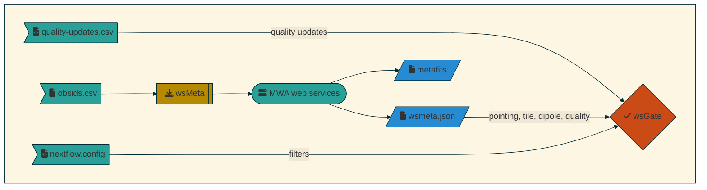
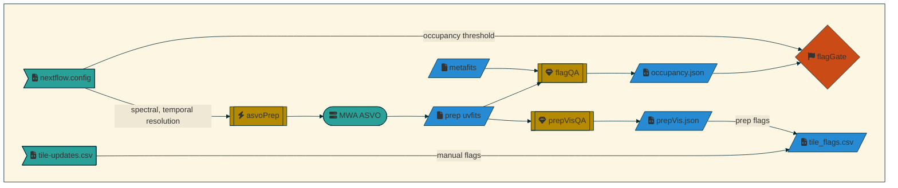
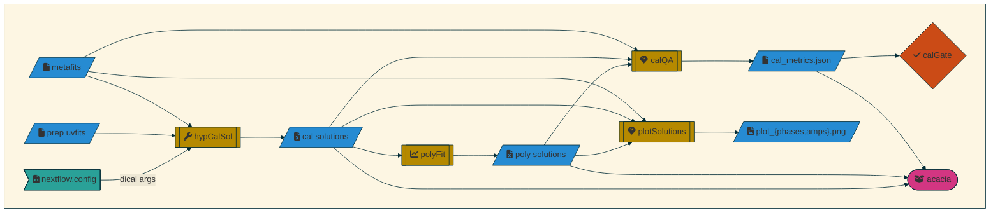
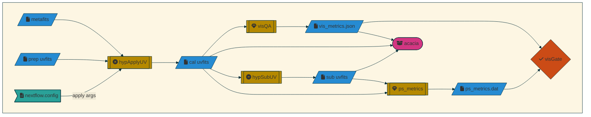

# MWA EoR Nextflow Pipeline

## Flow

The MWAEoR pipeline workflow takes a list of obsids and produces detailed metrics about the quality of the data by analysing the data in various stages. At the end of each stage is a gate, which prevents observations from passing to the next stage if an issue is found.

### Metadata



The metadata stage gathers information about each observation from MWA Web Services. This ranges from scheduling information to information about faults that occurred during the observation, as well as the status the files archived for the observation. This is used to filter observations based on a set of criteria that prevents observations with too many faults from passing through to further stages.

### Preprocessing



The Preprocessing stage produces and analyses uvfits visibilities that have been preprocessed, flagged and averaged by [Birli](https://github.com/MWATelescope/Birli) via [MWA ASVO](https://asvo.mwatelescope.org/). The flag occupancy of the uvfits files are analysed by `flagQA` for the presence of RFI over each coarse channel, and the RMS amplitude of the autocorrelations are measured across frequency and antenna by [`prepVisQA`](https://github.com/Chuneeta/mwa_qa/blob/main/scripts/run_prepvisqa.py). These measures are used to produce a list of outlier antennas, which should be flagged in later stages.

If the preprocessed files are not present, the `asvoPrep` process schedules a conversion job on ASVO using [Giant Squid](github.com/mwaTelescope/giant-squid). An exponential backoff is used to wait until the conversion job is ready to download from [Acacia](https://pawsey.org.au/systems/acacia/), then the archive is downloaded with `wget`, and hash-validated as it is inflated with `tar`.

Finally, observations whose flag occupancy is above the configured threshold threshold are rejected.

### Direction Independent Calibration



[Hyperdrive](github.com/mwaTelescope/mwa_hyperdrive) is used to generate one or more direction independent calibration solutions using the MWA Long Baseline Epoch of Reionisation Survey (LoBES) sky model.

It is possible to produce several independent calibration solutions for each obsid. A "smoothed" version of the calibration solutions is also generated by `polyFit`. Each calibration solution, as well as the smoothed solution are analysed independently.

The statistical properties of the calibration solutions are analysed with [`calQA`](https://github.com/Chuneeta/mwa_qa/blob/main/scripts/run_calqa.py). If the variance of an observation's calibration solutions is too high, then the observation is rejected.

### Calibrated Visibility Analysis



Calibrated UVFits visibilities are obtained by applying calibration solutions to the preprocessed visibilities. An analysis of redundant baseline groups is performed by [`visQA`](https://github.com/Chuneeta/mwa_qa/blob/main/scripts/run_visqa.py) to detect anomalous baselines that do not conform to the behaviour of their group.

An analysis of power spectrum metrics is performed by [`ps_metrics`](https://github.com/cathryntrott/chips) on these visibilities, as well as their residual, which is obtained by subtracting the simulated sky model from the calibrated visibilities. Power spectrum window contamination measurements are important for detecting where observations are not fit for the final power spectrum integration.

### Image Analysis

```mermaid
%%{init:{'theme':'base','themeVariables':{'primaryBorderColor':'#002b36','secondaryColor':'#eee8d5','tertiaryColor':'#fdf6e3','tertiaryBorderColor':'#002b36','lineColor':'#002b36','textColor':'#002b36'}}}%%
graph TD;
  classDef in fill:#2aa198;
  classDef out fill:#d33682;
  classDef file fill:#268bd2;
  classDef proc fill:#b58900;
  classDef decision fill:#cb4b16;

  subgraph " "
    metafits & prepUVFits --> hypApplyMS --> calMS --> hypSubMS --> subMS
    calMS & subMS --> wscleanDirty --> imgDirty --> imgQA --> imgMetricsJson
    imgMetricsJson & imgDirty --> acaciaImg
    imgMetricsJson -.-> imgGate
    nfConfig --"apply args"--> hypApplyMS

    nfConfig>fa:fa-file-code nextflow.config ]; class nfConfig in
    metafits[/fa:fa-file metafits /]; class metafits file
    prepUVFits[/fa:fa-file prep uvfits /]; class prepUVFits file
    calMS[/fa:fa-file cal ms /]; class calMS file
    hypApplyMS[[fa:fa-times-circle hypApplyMS ]]; class hypApplyMS proc
    subMS[/fa:fa-file sub ms /]; class subMS file
    hypSubMS[[fa:fa-minus-circle hypSubMS ]]; class hypSubMS proc
    imgDirty[/"fa:fa-file-image image-{XX,YY,V}-dirty.fits "/]; class imgDirty file
    wscleanDirty[[fa:fa-image wscleanDirty ]]; class wscleanDirty proc
    imgMetricsJson[/fa:fa-file img_metrics.json /]; class imgMetricsJson file
    imgQA[[fa:fa-gem imgQA]]; class imgQA proc;
    acaciaImg([fa:fa-box-open acacia]); class acaciaImg out
    imgGate{fa:fa-check imgGate }; class imgGate decision;

  end
```



Calibrated and residual visibilities from the calibrated visibility analysis stage are analysed in measurement set format. [wsclean](https://gitlab.com/aroffringa/wsclean) is used to make dirty (non-deconvolved) images of Stokes XX,YY and V polarisations, which are used by [`imgQA`](https://github.com/Chuneeta/mwa_qa/blob/main/scripts/run_imgqa.py) to obtain polarimetric power measurements.

## Output Directory Structure:

- `${params.outdir}/` (e.g. `/data/curtin_mwaeor/data/`)
  - `${obsid}/`
    - `raw/` - raw gpubox fits, metafits, metafits json
    - `prep/` - preprocessed birli vis uvfits (weights encode flags), flag mwaf, birli log,
      preprocessing stats json
    - `cal${params.cal_suffix}/` - calibrated vis uvfits, di-cal solution fits, hyperdrive di-cal,
      apply log
    - `img/` - wscleaned dirty XX,YY,V image fits
    - `flag_qa/` - flag occupancy json
    - `cal_qa/` - calibration metrics json, hyperdrive solution amp,phase plot png
    - `vis_qa/` - visibility metrics json
    - `img_qa/` - image metrics json
    - `ps_metrics/` - power spectrum metrics dat, log
  - `results/` - aggregate metrics for spreadsheet import
    - `raw_stats.tsv` - info from raw stage: raw/metafits size on disk, raw file count
    - `cal_metrics.tsv` - calQA metrics for each di calibration
    - `vis_metrics.tsv` - visQA metrics for each vis
    - `img_metrics.tsv` - imgQA metrics for each image
    - `ps_metrics.tsv` - power spectrum metrics for each vis

## Configuration

### obsids

populate `obsids.csv` with each obsid to be processed, one per line

```
obsid1
obsid2
```

### filters

these can be filtered by `params.filter_pointings`, `params.filter_bad_tile_frac`, `params.filter_dead_dipole_frac` and `params.filter_quality` in `nextflow.config`

### quality updates

if you discover several obsids are of poor quality, but you haven't yet updated the data quality number in the mwa metadata database, you can populate `quality-updates.csv` with `obsid,dataquality,dataqualitycomment` to filter these obsids

### tile updates path

if you discover tiles that need to be flagged manually over a range of obsids, you can populate `tile-updates.csv` with `startgps,endgps,tiles,comment` to manually flag these tiles during calibration. `tiles` are pipe separated tile indices as used in the TILE_DATA metafits HDU, and Hyperdrive calibraiton solution plots (tile61 == tile id #40 != tile id #61), e.g.

```txt
1125766160,1125767872,40|41|42|43|44|45|46|47,chaotic fringes in high channels on recv06
1126921360,1126923520,55,Tile98 fringes
1321443064,1321448344,4,Tile15 fringes
```

### di-cal args

multiple hyperdrive calibrations per obsid can be obtained by populating `params.dical_args` as a map of `[dical_name:dical_args]` in `nextflow.config`, where `dical_args` are passed to `hyperdrive di-cal`, e.g.

```
dical_args = [
  "30l_src4k": "--uvw-min 30l -n 4000",
  "50l_src1k": "--uvw-min 50l -n 1000",
]
```

all other config is in `nextflow.config`. See: <https://www.nextflow.io/docs/latest/config.html>

parameters can also be specified in the newflow command line for each run too. e.g. set `params.obsids_path` with `--obsids_path=...`

## usage

- Ensure a profile has been set up in `nextflow.config` for your cluster or local machine (see: `profiles.dug`, `profiles.garrawarla`).
- Ensure `nextflow` version 21 is available (more on this later).
- Ensure the `export MWA_ASVO_API_KEY=...` environment is set.
- Tip: You'll want to run this inside of `tmux` or `screen`, otherwise all your jobs will be cancelled when your ssh connection is interrupted. `nohup` doesn't seem to work.
- Tip: I like to work out of a vscode remote ssh session on hpc-data, since the head node is much slower. just bear in mind you need to `ssh garrawarla` to run the pipeline or see `squeue`.

```bash
nextflow run main.nf -profile <profile> -with-timeline -with-report -with-dag --asvo_api_key=$MWA_ASVO_API_KEY
```

if you would like to run run only a subset of obsids, you can specify them in a file, e.g. `obsids-test.csv`

```bash
nextflow run main.nf --obsids_path=obsids-test.csv
```

you can also modify any of the params in `nextflow.config` from the command line, e.g.

```bash
nextflow run main.nf --img_suffix='-briggs+0.5' --img_weight='briggs +0.5'
```

### pawsey quirks

Running this pipeline on Pawsey requires the `cluster_edit` nextflow module. Get the available versions of nextflow with `module avail nextflow` and load the module with (e.g.)

```bash
module load nextflow_cluster_edit/22.04.3_cluster_edit
```

then run nextflow with

```bash
nextflow run main.nf -profile garrawarla
```

architecture reference:
- garra workq & gpuq: `Intel(R) Xeon(R) Gold 6230` (cascade lake)
- garra head: `Intel(R) Xeon(R) Silver 4215` - (cascade lake)
- hpc-data{1..6} (zeus): `AMD EPYC 7351`

### dug quirks

nextflow module conflicts with singularity for dumb Java reasons.

```
module unload singularity
module load nextflow
nextflow run main.nf -profile dug
```

## handy Nextflow commands

### get times of jobs of the last run

```bash
export run_name="$(nextflow log -q | tail -n 1)"
export filter='process=~/.*hypCalSol/'
nextflow log "${run_name}" -F "${filter}" -f "workdir,exit,status,process,tag,duration,realtime,memory,peak_vmem"
```

### get all lines matching pattern from all scripts executed recently

```bash
export process="hypCalSol"
export first_run="$(nextflow log -q | head -n 1)"
echo -n $'${start} ${workdir} ${script.split(\'\\n\').findAll {it =~ /.*wsclean.*/}[0]}' | tee template.md
nextflow log -after $first_run -F 'process=="'${process}'"&&exit==0' -t template.md
```

### show the script of last few runs

`head -n -1` only if a pipeline is currently running

```bash
while read run; do
  echo $run
  nextflow log $run \
    -f workdir,exit,status,process,duration,script \
    -filter 'process == "wscleanDirty" && exit == 0'
done < <(nextflow log -q | tail -n 50 | head -n -1) | tee runs.txt
```

### suffixes

```
# this will put results in $outdir/test/results-a-b-c-d
nextflow run main.nf -profile garrawarla --outdir=$outdir/test/ --img_suffix=-a --cal_suffix=-b --obsids_suffix=-c --results_suffix=-d
```

## Handy Singularity commands

### Updating singularity images

```bash
module load singularity
# - specify the container to update:
export container="mwa_qa" # or "birli"
# - specify the url of the docker image
export url="docker://mwatelescope/${container}:latest" # or "docker://d3vnull0/${container}:latest"
# - cd into singularity directory
cd /pawsey/mwa/singularity/ # or /data/curtin_mwaeor/sw/singularity/
# - make a directory for the container if it doesn't exist
[ -d $container ] || mkdir $container
# - create the singularity image
singularity pull --force --dir $container "$url"
```

optional: update `profiles.<profile>.params.<container>_sif` in `nextflow.config` if things have changed

## Handy slurm commands

### Cancel all failed jobs

```bash
squeue -u $USER --format %A -h --states SE | sort | xargs scancel
```

### get info for jobid: standard out

```bash
export jobid=3405303
squeue --json | /pawsey/mwa/dev/bin/jq -r '.jobs[]|select(.job_id==$jobid)|.standard_output' --argjson jobid 3459463
```

## Handy Giant Squid Commands

### get obsids that are ready to download

```bash
giant-squid list --states=Ready -j | jq -r '.[]|[.obsid]|@csv' | tee obsids-ready.csv | tee /dev/stderr | wc -l
```

### reschedule conversion jobs where some failed.

```bash
giant-squid list --states=Error -j | jq -r '.[]|[.obsid]|@csv' \
  | while read -r obsid; do giant-squid submit-conv \
    -p timeres=2,freqres=40,conversion=uvfits,preprocessor=birli $obsid; done
```

## handy storage commands

### get disk usage of each stage

```bash
export outdir="/data/curtin_mwaeor/data"
# export outdir="/astro/mwaeor/dev/nfdata"
for stage in cal cal_qa flag_qa img img_qa prep ps_metrics raw vis_qa; do
  find $outdir -type d -name "${stage}" | xargs du -csh | tee "du_${stage}.tsv"
done
```

### make csv file of all obsids at various stages

```bash
export outdir="/data/curtin_mwaeor/data"
# export outdir="/astro/mwaeor/dev/nfdata"
# downloaded, preprocessed.
find $outdir -type f -path '*/prep/birli_*.uvfits' -print | sed -e 's!.*/\([0-9]\{10\}\)/.*!\1!g' | sort | uniq | tee obsids-downloaded.csv | tee /dev/stderr | wc -l
# calibrated
find $outdir -type f -path '*/cal/hyp_*.uvfits' -print | sed -e 's!.*/\([0-9]\{10\}\)/.*!\1!g' | sort | uniq | tee obsids-calibrated.csv | tee /dev/stderr | wc -l
# images
ls $outdir/*/img/*.fits | cut -d / -f 5 | sort | uniq | tee obsids-imgd.csv | tee /dev/stderr | wc -l
```

### get files not downloaded

```bash
comm -13 <(sort obsids-downloaded.csv) <(sort obsids-stage1.csv) > obsids-stage1-undownloaded.csv
```

### clear blank logs

```bash
find $outdir -name '*.log' -size 0 -delete
```

### add suffix to existing file stage

```bash
bash -c 'unset PATH; /bin/find ${outdir} -type d -name img_qa -execdir sh -c "pwd && mv {} {}-dci1000" \;'
```

add suffix but keep original cal

```bash
export suffix="-oldhyp"
for dir in ??????????/{cal_qa,vis_qa,img_qa,img-briggs+0.5_4096px,img_qa-briggs+0.5_4096px}; do
  [ -d "${dir}" ] && mv "${dir}" "${dir}${suffix}";
done
for dir in ??????????/cal; do
  [ -d "${dir}" ] && mv "${dir}" "${dir}-kill";
done
for dir in ??????????/cal-kill; do
  mkdir -p "${dir/-kill/}";
  for file in ${dir}/hyp_*.fits ${dir}/hyp_di-cal*.log; do
    [ -f "${file}" ] && mv "${file}" "${file/-kill/}";
  done
  rm -rf "${dir}";
done
for dir in ??????????/*-oldhyp; do
  rm -rf "${dir}";
done
```

### cleanup folders

```
cd ${outdir}
for obsid in ...; do
  [ -d ${outdir}/$obsid ] && rm -rf ${outdir}/$obsid
done
```

### cleanup files

```bash
cd ${outdir}
for obsid in $(ls); do
  # export path=${obsid}/raw/${obsid}.metafits.json
  # export path=${obsid}/prep/${obsid}_prep_stats.json
  # export path=${obsid}/{vis_qa,img_qa,cal_qa}/*.json
  # export path=${obsid}/vis_qa/*.json
  export path=${obsid}/img_qa/*.json
  # export path=${obsid}/cal_qa/*.json
  for path in $path; do
    [ -f "$path" ] && echo "$path" && rm -rf "$path"
  done
done
find ${outdir} -path '*/*_qa/*.json' # -delete
find ${outdir} -path '*/cal/*.ms' -exec sh -c 'echo rm -rf {}' \;
```

```bash
for obsid in ...; do
  echo $obsid
  # find ${outdir}/$obsid -type f -path './img_qa/*.png' #-delete
  rm -f ${outdir}/${obsid}/img_qa/*.png
done
```

### download calibration solutions

```bash
module load rclone
cd $outdir
while read -r obsid; do
  mkdir -p ${obsid}/cal-noflag
  rclone copy mwaeor:high0.soln/hyp_soln_${obsid}_30l_src4k.fits ${obsid}/cal-noflag/
  touch ${obsid}/cal-noflag/hyp_di-cal_${obsid}_30l_src4k_8s_80kHz.log
done < obsids.csv
```

## Misc handy commands

### Carta

```bash
export carta_sif=/data/curtin_mwaeor/sw/singularity/carta/carta_latest.sif
export carta_sif=/pawsey/mwa/singularity/carta/carta_latest.sif
```

no config

```bash
singularity exec --bind $PWD:/images --contain $carta_sif carta --no_user_config --no_system_config --no_browser /images
```

user config

```bash
singularity exec --bind $outdir:/images /data/curtin_mwaeor/sw/singularity/carta/carta_latest.sif carta --no_system_config --debug_no_auth /images
```

open `all_imgs`, sort by name, unix search `wsclean_hyp_*_sub_poly_30l_src4k_8s_80kHz-MFS-XX-dirty.fits`

### export image snippet

enable code snippets in carta first

```js
for (const frame of app.frames) {
  frame.setTitleCustomText(frame.filename);
  await app.setRasterScalingMatchingEnabled(frame, true);
  await app.setActiveFrame(frame);
  await new Promise(r => setTimeout(r, 1000));
  console.log(app.activeFrame.filename);
  await app.exportImage(1);
  await new Promise(r => setTimeout(r, 1000));
};
```

### hard link images (easier for carta)

```bash
find ${outdir} -path '*/img/wsclean*.fits' -exec sh -c 'ln {} all_imgs/$(basename {})' \;
```

### copy all metafits to hopper

```bash
find ${outdir} -regextype posix-extended  -regex './[0-9]{10}/raw/[0-9]{10}.metafits.json' | while read -r p; do cp $p /data/curtin_mwaeor/FRB_hopper/; done
```

### ipython via conda

create env

```bash
conda create --prefix /data/curtin_mwaeor/sw/conda/dev astropy ipython scipy 'numpy<1.23.0' scipy matplotlib pandas seaborn six ipykernel
```

add new modules

```bash
conda install --prefix /data/curtin_mwaeor/sw/conda/dev astropy ipython scipy 'numpy<1.23.0' scipy matplotlib pandas seaborn six ipykernel
```

```bash
module load miniconda/4.10.3
conda activate /data/curtin_mwaeor/sw/conda/dev
ipython
```

```python
from astropy.io import fits
hdus=fits.open('/data/curtin_mwaeor/data/1060539904/raw/1060539904.metafits')
hdus=fits.open('/data/curtin_mwaeor/data/test/1343457784/raw/1343457784.metafits')
hdus=fits.open('/data/curtin_mwaeor/data/1322827024/raw/1322827024.metafits')
print('\n'.join(map(lambda row: ','.join(map(str, row)), hdus['TILEDATA'].data['Delays'].tolist())))
hdus=fits.open('/data/curtin_mwaeor/data/1060539904/cal/hyp_soln_1060539904_30l_src4k.fits')
hdus=fits.open('/data/curtin_mwaeor/data/1322827024/cal/hyp_soln_1322827024_30l_src4k.fits')
hdus=fits.open('/data/curtin_mwaeor/data/1090094680/cal/hyp_soln_1090094680_30l_src4k.fits')
print('\n'.join(map(lambda row: ','.join(map(str, row)), hdus['TILES'].data['DipoleGains'].tolist())))

hdus=fits.open('/data/curtin_mwaeor/data/1060540392/prep/birli_1060540392.uvfits')
```

### mwa_qa debugging

```python
import sys
from astropy.io import fits
from mwa_qa.read_uvfits import UVfits
from mwa_qa.read_calfits import CalFits
# hdus=fits.open('1061319840/cal/hyp_1061319840_sub_30l_src4k_8s_80kHz.uvfits')
uvf = UVfits('1061319840/cal/hyp_1061319840_sub_30l_src4k_8s_80kHz.uvfits')
cf = CalFits('1251908712/cal/hyp_soln_1251908712_30l_src4k.fits')
```

### run json query on metrics

```bash
find /data/curtin_mwaeor/data/ -type f -path '*/cal_qa/*X.json' -print -exec jq -r '(.CONVERGENCE//[])[0]|length' {} \; | tee has_convergence.txt
```


### tap stuff

```python
import pyvo as vo
tap = vo.dal.TAPService("http://vo.mwatelescope.org/mwa_asvo/tap")
results = tap.search("select obs_id, gpubox_files_archived, gpubox_files_total, total_archived_data_bytes \
  from mwa.observation \
  where obs_id IN (1087250776)")
```

### manually render movies

#### render prepvisqa

```bash
# singularity exec /pawsey/mwa/singularity/ffmpeg/ffmpeg_latest.sif ffmpeg
module load ffmpeg
# ,crop=in_w-3600:in_h:800:in_h
ffmpeg -y -framerate 5 -pattern_type glob \
 -i "${outdir}/??????????/prep/prepvis_metrics_??????????_rms.png" \
  -vf "pad=ceil(iw/2)*2:ceil(ih/2)*2" \
  -pix_fmt yuv420p \
  "${outdir}/results/prepvis_metrics_rms.mp4"
```

#### render polcomps

```bash
module load ffmpeg
# ,crop=in_w-3600:in_h:800:in_h
for name in 30l sub_30l; do
  ffmpeg -y -framerate 5 -pattern_type glob\
  -i "${outdir}/??????????/img_qa/??????????_${name}_*.png" \
  -vf "pad=ceil(iw/2)*2:ceil(ih/2)*2" -pix_fmt yuv420p \
  "${outdir}/results/polcomp_${name}.mp4"
done
for range in 122 125 132; do
  for name in 30l sub_30l; do
    ffmpeg -y -framerate 5 -pattern_type glob\
    -i "${outdir}/${range}???????/img_qa-briggs+0.5_4096px/??????????_${name}_*.png" \
    -vf "pad=ceil(iw/2)*2:ceil(ih/2)*2" \
    -pix_fmt yuv420p \
    "${outdir}/results/polcomp_${range}_${name}_briggs+0.5_4096px.mp4"
  done
done
```

#### render visQA

```bash
module load ffmpeg
# ,crop=in_w-3600:in_h:800:in_h
ffmpeg -y -framerate 5 -pattern_type glob\
  -i "${outdir}/??????????/vis_qa/hyp_??????????_30l_src4k_8s_80kHz_vis_metrics_rms.png" \
  -vf "pad=ceil(iw/2)*2:ceil(ih/2)*2" \
  -pix_fmt yuv420p \
  "${outdir}/results/vis_metrics_rms.mp4"
```

#### render calQA

```bash
module load ffmpeg
# ,crop=in_w-3600:in_h:800:in_h
for name in 30l_src4k_dlyspectrum poly_30l_src4k_dlyspectrum 30l_src4k_fft poly_30l_src4k_fft 30l_src4k_variance poly_30l_src4k_variance; do
  ffmpeg -y -framerate 5 -pattern_type glob\
  -i "${outdir}/??????????/cal_qa/calmetrics_??????????_${name}.png" \
  -vf "pad=ceil(iw/2)*2:ceil(ih/2)*2" \
  -pix_fmt yuv420p \
  "${outdir}/results/calmetrics_${name}.mp4"
done
```

#### plot solutions

```bash
module load ffmpeg
# ,crop=in_w-3600:in_h:800:in_h
for name in 30l_src4k_phases poly_30l_src4k_phases 30l_src4k_amps poly_30l_src4k_amps; do
  ffmpeg -y -framerate 5 -pattern_type glob\
  -i "${outdir}/??????????/cal_qa/hyp_soln_??????????_${name}.png" \
  -vf "pad=ceil(iw/2)*2:ceil(ih/2)*2" \
  -pix_fmt yuv420p \
  "${outdir}/results/hyp_soln_${name}.mp4"
done
for name in 30l_src4k_phases 30l_src4k_amps; do
  ffmpeg -y -framerate 5 -pattern_type glob\
  -i "${outdir}/12????????/cal_qa/hyp_soln_??????????_${name}.png" \
  -vf "pad=ceil(iw/2)*2:ceil(ih/2)*2" \
  -pix_fmt yuv420p \
  "${outdir}/results/hyp_soln_12_${name}.mp4"
done
```

### kickstart obsid from acacia

```bash
export obsid=...
cd $outdir
mkdir $obsid
cd $obsid
mkdir -p raw
wget -O raw/${obsid}.metafits "http://ws.mwatelescope.org/metadata/fits?obs_id=${obsid}&include_ppds=1"
mkdir -p prep
rclone copy mwaeor:high0.prep/birli_${obsid}_2s_40kHz.uvfits prep/
mkdir -p cal
touch cal/hyp_di-cal_${obsid}_30l_src4k.log
rclone copy mwaeor:high0.soln/hyp_soln_${obsid}_30l_src4k.fits cal/
touch cal/hyp_apply_30l_src4k_8s_80kHz.log
rclone copy mwaeor:high0.uvfits/hyp_${obsid}_30l_src4k_8s_80kHz.uvfits cal/
touch cal/hyp_vis-sub_30l_src4k_8s_80kHz_uv.log
rclone copy mwaeor:high0.uvfits/hyp_${obsid}_sub_30l_src4k_8s_80kHz.uvfits cal/
mkdir -p img
touch img/wsclean_30l_src4k_8s_80kHz.log
rclone copy mwaeor:high0.img/wsclean_hyp_${obsid}_30l_src4k_8s_80kHz-MFS-$'{XX,YY,V}'-dirty.fits img/
touch img/wsclean_sub_30l_src4k_8s_80kHz.log
```

#### redo imagqa from acacia

```bash
export name="sub_30l_src4k_8s_80kHz"
while read -r obsid; do rclone copy mwaeor:high0.imgqa/wsclean_hyp_${obsid}_${name}.json .; jq -r '['${obsid}',"'${name}'",.XX.RMS_ALL,.XX.RMS_BOX,.XX.PKS0023_026?.PEAK_FLUX,.XX.PKS0023_026?.INT_FLUX,.YY.RMS_ALL,.YY.RMS_BOX,.YY.PKS0023_026.PEAK_FLUX,.YY.PKS0023_026.INT_FLUX,.V.RMS_ALL,.V.RMS_BOX,.V.PKS0023_026?.PEAK_FLUX,.V.PKS0023_026?.INT_FLUX,.V_XX.RMS_RATIO,.V_XX.RMS_RATIO_BOX]|@csv' wsclean_hyp_${obsid}_${name}.json; done < obsids-stage2imgqa.csv | tee img_metrics.csv
```

#### Fast flagged vs unflagged

```bash
for name in 30l_src4_fast_amps 30l_src4_fast_phases; do
  ffmpeg -y -framerate 5 -pattern_type glob -i '/data/curtin_mwaeor/data/??????????/cal_qa-flagged-fast/hyp_soln_??????????_'$name'.png' -vf "pad=ceil(iw/2)*2:ceil(ih/2)*2" -pix_fmt yuv420p "/data/curtin_mwaeor/data/results-test/hyp_soln_${name}-flagged.mp4"
  ffmpeg -y -framerate 5 -pattern_type glob -i '/data/curtin_mwaeor/data/??????????/cal_qa-unflagged-fast/hyp_soln_??????????_'$name'.png' -vf "pad=ceil(iw/2)*2:ceil(ih/2)*2" -pix_fmt yuv420p "/data/curtin_mwaeor/data/results-test/hyp_soln_${name}-unflagged.mp4"
done
for name in 30l_src4_fast_variance 30l_src4_fast_fft 30l_src4_fast_dlyspectrum; do
  ffmpeg -y -framerate 5 -pattern_type glob -i '/data/curtin_mwaeor/data/??????????/cal_qa-flagged-fast/calmetrics_??????????_'$name'.png' -vf "pad=ceil(iw/2)*2:ceil(ih/2)*2" -pix_fmt yuv420p "/data/curtin_mwaeor/data/results-test/calmetrics_${name}-flagged.mp4"
  ffmpeg -y -framerate 5 -pattern_type glob -i '/data/curtin_mwaeor/data/??????????/cal_qa-unflagged-fast/calmetrics_??????????_'$name'.png' -vf "pad=ceil(iw/2)*2:ceil(ih/2)*2" -pix_fmt yuv420p "/data/curtin_mwaeor/data/results-test/calmetrics_${name}-unflagged.mp4"
done
```

### ionpeel?

```bash
module use /pawsey/mwa/software/python3/modulefiles
module load hyperdrive
module load singularity
export obsid=1254670880
cd ${outdir}
mkdir -p "${obsid}/iono"
hyperdrive srclist-by-beam --metafits "${obsid}/raw/${obsid}.metafits" \
  -n 400 -o ao \
  /astro/mwaeor/dev/calibration/srclist_pumav3_EoR0LoBESv2_fixedEoR1pietro+ForA_phase1+2_edit.txt \
  "${obsid}/iono/ionpeel_model_400.txt"
singularity exec \
  -B /pawsey/mwa:/usr/lib/python3/dist-packages/mwapy/data \
  /pawsey/mwa/singularity/mwa-reduce/mwa-reduce.img \
  cluster \
    "${obsid}/iono/ionpeel_model_400.txt" \
    "${obsid}/iono/ionpeel_clustered_model_400_50.txt" \
    50
singularity exec \
  -B /pawsey/mwa:/usr/lib/python3/dist-packages/mwapy/data \
  /pawsey/mwa/singularity/mwa-reduce/mwa-reduce.img \
  ionpeel \
  "${obsid}/cal/hyp_${obsid}_30l_src4k_8s_80kHz.ms" \
  "${obsid}/iono/ionpeel_clustered_model_400_50.txt" \
  "${obsid}/iono/ionpeel_clustered_soln_400_50.bin"

# applyion wsclean-image.fits ioncorrected.fits clustered-model.txt ionsolutions.bin
singularity exec \
  -B /pawsey/mwa:/usr/lib/python3/dist-packages/mwapy/data \
  /pawsey/mwa/singularity/mwa-reduce/mwa-reduce.img \
  applyion
```

```bash
module load wsclean
export range=125
mkdir -p "${outdir}/${range}XXXXXXX/img_qa-briggs+0.5_4096px"
cd "${outdir}/${range}XXXXXXX/img_qa-briggs+0.5_4096px"
wsclean \
  -weight briggs +0.5 \
  -name wsclean_hyp_${range}XXXXXXX_sub_30l_src4k_8s_80kHz \
  -size 4096 4096 \
  -scale 40asec \
  -pol xx,yy,v \
  -channels-out 68 \
  -niter 0 \
  -parallel-reordering 8 \
  ../../${range}???????/cal/hyp_${range}???????_sub_30l_src4k_8s_80kHz.ms
```

### quick apply MS with different res

```bash
salloc --nodes=1 --mem=350G --gres=gpu:1 --time=8:00:00 --clusters=garrawarla --partition=gpuq --account=mwaeor -c 18
export obsid=1255528600
export time_res=2
export freq_res=80
module load hyperdrive/peel
mkdir /dev/shm/deleteme
cd /dev/shm/deleteme
cp /astro/mwaeor/dev/nfdata/${obsid}/prep/birli_${obsid}_2s_40kHz.uvfits .
cp /astro/mwaeor/dev/nfdata/${obsid}/cal/hyp_soln_${obsid}_30l_src4k.fits .
cp /astro/mwaeor/dev/nfdata/$obsid/raw/${obsid}.metafits .
hyperdrive solutions-apply \
  --time-average "${time_res}s" --freq-average "${freq_res}kHz" \
  --data "${obsid}.metafits" "birli_${obsid}_2s_40kHz.uvfits" \
  --solutions "hyp_soln_${obsid}_30l_src4k.fits" \
  --outputs "hyp_${obsid}_30l_src4k_${time_res}s_${freq_res}kHz.ms"
tar -zcvf "hyp_${obsid}_30l_src4k_${time_res}s_${freq_res}kHz.ms.tar.gz" \
  "hyp_${obsid}_30l_src4k_${time_res}s_${freq_res}kHz.ms"
cp "hyp_${obsid}_30l_src4k_${time_res}s_${freq_res}kHz.ms.tar.gz" /astro/mwaeor/dev/frbhopper/

hyperdrive vis-sub \
  --data "${obsid}.metafits" "hyp_${obsid}_30l_src4k_${time_res}s_${freq_res}kHz.ms" \
  --beam "/pawsey/mwa/mwa_full_embedded_element_pattern.h5" \
  --source-list "/astro/mwaeor/dev/calibration/srclist_pumav3_EoR0LoBESv2_fixedEoR1pietro+ForA_phase1+2_edit.txt" \
  --invert --num-sources 4000 \
  --outputs "hyp_${obsid}_sub_30l_src4k_${time_res}s_${freq_res}kHz.ms"

hyperdrive peel \
  --data "${obsid}.metafits" "hyp_${obsid}_30l_src4k_${time_res}s_${freq_res}kHz.ms" \
  --beam "/pawsey/mwa/mwa_full_embedded_element_pattern.h5" \
  --source-list "/astro/mwaeor/dev/calibration/srclist_pumav3_EoR0LoBESv2_fixedEoR1pietro+ForA_phase1+2_edit.txt" \
  --iono-sub 1000 \
  --sub 4000 \
  --outputs "hyp_${obsid}_ionosub_30l_src4k_${time_res}s_${freq_res}kHz.ms"

```

### wsclean

```bash
salloc --nodes=1 --mem=350G --time=8:00:00 --clusters=garrawarla --partition=workq --account=mwaeor --ntasks=20 --tmp=500G
module load singularity
mkdir /dev/shm/deleteme
cd /dev/shm/deleteme
export obsid=1090012424
# export suffix=""
# export suffix="_sub"
export suffix="_ionosub"
singularity exec --bind /astro --bind /pawsey --bind $PWD:/tmp --writable-tmpfs --pwd /tmp --home $PWD --cleanenv \
    /pawsey/mwa/singularity/casa/casa.img \
    casa -c "importuvfits('/astro/mwaeor/dev/nfdata/${obsid}/cal/hyp_${obsid}${suffix}_30l_src4k_8s_80kHz.uvfits', 'hyp_${obsid}${suffix}_30l_src4k_8s_80kHz.ms')"
export img_weight='briggs -1.0'
export img_size=2048
export img_scale='40asec'
export img_pol='xx,yy,v'
export img_channels_out=24
export img_intervals_out=15
wsclean \
    -name hyp_${obsid}${suffix}_30l_src4k_8s_80kHz \
    -weight ${img_weight} \
    -size ${img_size} ${img_size} \
    -scale ${img_scale} \
    -pol ${img_pol} \
    -channels-out ${img_channels_out} \
    -niter 0 \
    -intervals-out ${img_intervals_out} \
    hyp_${obsid}${suffix}_30l_src4k_8s_80kHz.ms
```

### fits2png

```bash
salloc --nodes=1 --mem=350G --time=8:00:00 --clusters=garrawarla --partition=workq --account=mwaeor --ntasks=20 --tmp=500G
module load singularity
for fits in $(ls *.fits); do
  singularity exec --cleanenv --home /astro/mwaeor/dev/mplhome \
    /pawsey/mwa/singularity/mwa_qa/mwa_qa_latest.sif python \
    /astro/mwaeor/dev/MWAEoR-Pipeline/templates/thumbnail.py \
      --fits=${fits} \
      --output_name=${fits%.fits}.png \
      --plot_title=${fits%.fits} \
      --cmap=plasma & \
done
```